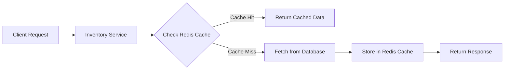

# Ticket Booking System (Microservices Architecture)

  
  
  
  
  
  
  
  

---

## Overview (Distributed Systems)

A scalable **Spring Boot microservices-based ticket booking system** built with:

- Event-driven architecture using Kafka  
- Redis caching for high-performance inventory access  
- Secure authentication via Keycloak  
- Observability using Spring Boot Actuator  
- Containerized setup using Docker
- Used swagger-ui for API documentation

---

## Services Breakdown

---

### Booking Service

**Responsibilities:**
- Handles booking creation requests  
- Persists customer/booking data using `CustomerRepository`  
- Calls Inventory Service via `InventoryServiceClient` to fetch/validate availability  
- Constructs and publishes `BookingEvent` to Kafka  
- Uses `KafkaTemplate` for event publishing  
- Transforms request → entity → response objects  
- Logs booking lifecycle using structured logging  

---

### Inventory Service

**Responsibilities:**
- Fetches all events and their remaining capacity from `EventRepository`  
- Retrieves venue-level information from `VenueRepository`  
- Maps database entities (`Event`, `Venue`) to response DTOs  
- Provides aggregated inventory views (event + venue data)  
- Uses stream processing to transform entity lists into API responses  
- Logs inventory operations for observability  

---

### Order Service

**Responsibilities:**
- Listens to Kafka topic (`booking`) using `@KafkaListener`  
- Consumes `BookingEvent` asynchronously  
- Creates `Order` entity from booking event data  
- Persists orders using `OrderRepository`  
- Calls Inventory Service via `InventoryServiceClient` to update inventory  
- Ensures eventual consistency between booking and inventory  
- Logs event consumption and inventory updates  

---

### Kafka

**Responsibilities:**
- Enables asynchronous communication between services  
- Handles booking lifecycle events  
- Decouples services for better scalability  
- Supports event-driven architecture  

## Kafka Interaction Flow

---

### Redis

**Responsibilities:**
- Caches frequently accessed inventory data  
- Reduces database load  
- Improves API response time  
- Supports high-throughput read operations

## Redis Flow (Inventory Service)

---

### Keycloak

**Responsibilities:**
- Provides centralized authentication  
- Issues JWT tokens  
- Enforces role-based access control  
- Secures microservices endpoints  

---

### MySQL

**Responsibilities:**
- Stores booking and inventory data  
- Ensures transactional consistency  
- Acts as the primary source of truth  

---

### Spring Boot Actuator

**Responsibilities:**
- Provides health check endpoints  
- Exposes application and JVM metrics  
- Enables runtime monitoring and diagnostics  
- Improves observability in production  

---

### Docker

**Responsibilities:**
- Containerizes all services and infrastructure  
- Ensures consistent environments  
- Simplifies setup and deployment  
- Enables easy orchestration of dependencies  

---

## Redis Caching Strategy

- Cache key format: `booking:{id}`  
- Value format: JSON  
- TTL: Configurable  

**Benefits:**
- Faster read performance  
- Reduced database load  
- Improved scalability  

---

## Logging & Observability
- Logs key service-layer operations  
- Logs Kafka event publishing and consumption  
- Tracks inventory update operations  
- Exposes Actuator endpoints for monitoring  

**Actuator Endpoints:**
- /actuator/health  
- /actuator/metrics  
- /actuator/info  

**Benefits:**
- Health monitoring of services  
- Easier debugging and tracing  
- Better production observability  
- Faster issue detection   

